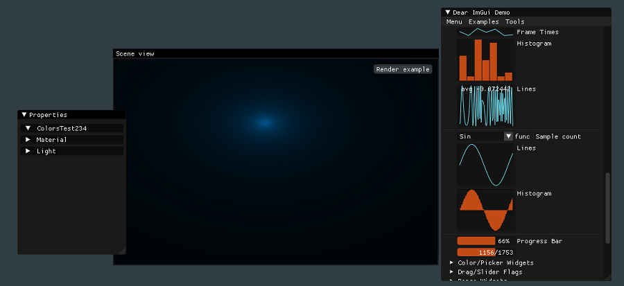

# ogl-gui-starter

This application is a simple OpenGL window using GLFW3 with imgui embedded as graphical user interface.
It's purpose is to be used as a starting point for OpenGL projects that
need a gui.
A few useful helper classes for rendering, file reading/writing etc. are provided.

> **Note**:
Support for OpenGL 4.3 core profile is required.

## How to Compile
Clone the repo:
```bash
git clone git://github.com/MisterRooster/ogl-gui-starter.git
cd ogl-gui-starter 
```

Then simply run CMake with your favourite IDE. Tested with Visual Studio 2022,
no working guarantee for other environments.
Example commands for VS 2022:
```bash
mkdir build
cd build
cmake -G "Visual Studio 17"..
```

## 3rd Party

**ogl-gui-starter** uses 3rd party software, they are located in the `./dependencies` folder as submodules and built with the program. A copy of each is included in the repository when built.
Structure and description of 3rd parts libraries and related copyrights and licenses:

 - dependecies/**imgui** → Dear ImGui
[https://github.com/ocornut/imgui](https://github.com/ocornut/imgui) - [*License*](https://github.com/ocornut/imgui/blob/v1.89.8-docking/LICENSE.txt)<br>
uses **docking** release of **imGui** - [*tag (v1.89.8-docking)*](https://github.com/ocornut/imgui/tree/v1.89.8-docking)

- dependecies/**glfw** → A multi-platform library for OpenGL, OpenGL ES, Vulkan, window and input
 [https://github.com/glfw/glfw](https://github.com/glfw/glfw) - [*License*](https://github.com/glfw/glfw/blob/3.3.8/LICENSE.md)<br>
uses version 3.3.8 - [*tag (3.3.8)*](https://github.com/glfw/glfw/tree/3.3.8)

- dependencies/**glew** → GL/GLES/EGL/GLX/WGL Loader
[https://github.com/nigels-com/glew](https://github.com/nigels-com/glew) - [*License*](https://github.com/nigels-com/glew/tree/glew-2.2.0)<br>
uses a slightly altered version compatible with *CMake* named [**glew-cmake**](https://github.com/Perlmint/glew-cmake) - [*tag (glew-cmake-2.2.0)*](https://github.com/Perlmint/glew-cmake/tree/glew-cmake-2.2.0)

- dependencies/**glm** → OpenGL vector and matrix math with SIMD
[https://github.com/g-truc/glm](https://github.com/g-truc/glm) - [*License*](https://github.com/g-truc/glm/blob/47585fde0c49fa77a2bf2fb1d2ead06999fd4b6e/copying.txt)<br>
uses version 9.9.8 - [*commit (47585fd)*](https://github.com/g-truc/glm/tree/47585fde0c49fa77a2bf2fb1d2ead06999fd4b6e)

-----
Copyright (c) 2022 MisterRooster ([github.com/MisterRooster](https://github.com/MisterRooster)). All rights reserved.  
Licensed under the MIT license. See [LICENSE](LICENSE) for full terms.