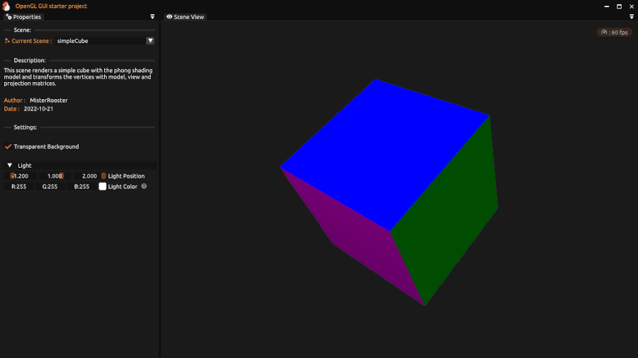

# ogl-gui-starter

This project is a small OpenGL application using GLFW3 with imgui embedded as graphical user interface.
It's purpose is to be used as a basis to quickly prototyping and implementing OpenGL scenarios or as a starting point for your own gui OpenGL application.
Same useful helper classes for rendering, file reading/writing etc. are provided.

> **Note**:
Support for OpenGL 4.4 core profile is required.

## How to Compile

Clone the repo:

```bash
git clone git://github.com/MisterRooster/ogl-gui-starter.git
```

Then simply run CMake with your favourite IDE. Tested with Visual Studio 2022,
no working guarantee for other environments.
Example commands for VS 2022:

```bash
cd ogl-gui-starter 
mkdir build
cd build
cmake -G "Visual Studio 17"..
```

If you are using **Visual Studio Code**, checkout [How to compile with VS Code](docs/compile-instructions-vscode.md).

## 3rd Party

**ogl-gui-starter** uses 3rd party software, which are located in the `./dependencies` folder as submodules and built with the program. A copy of each is included in the repository when built.
Structure and description of 3rd parts libraries and related copyrights & licenses:

- dependecies/**glfw** → A multi-platform library for OpenGL, OpenGL ES, Vulkan, window and input<br>
uses version 3.3.8 - [*tag (3.3.8)*](https://github.com/glfw/glfw/tree/3.3.8) - [*License*](https://github.com/glfw/glfw/blob/3.3.8/LICENSE.md)

- dependencies/**glew** → GL/GLES/EGL/GLX/WGL Loader<br>
uses a slightly altered version compatible with *CMake* named [**glew-cmake**](https://github.com/Perlmint/glew-cmake) - [*tag (glew-cmake-2.2.0)*](https://github.com/Perlmint/glew-cmake/tree/glew-cmake-2.2.0) - [*License*](https://github.com/nigels-com/glew/blob/glew-2.2.0/LICENSE.txt)

- dependencies/**glm** → OpenGL vector and matrix math with SIMD<br>
uses version 9.9.8 - [*commit (47585fd)*](https://github.com/g-truc/glm/tree/47585fde0c49fa77a2bf2fb1d2ead06999fd4b6e) - [*License*](https://github.com/g-truc/glm/blob/47585fde0c49fa77a2bf2fb1d2ead06999fd4b6e/copying.txt)

- src/thirdparty/**stb_image.h** → Single file image loader<br>
uses version 2.28 - [*commit (5736b15)*](https://github.com/nothings/stb/tree/5736b15f7ea0ffb08dd38af21067c314d6a3aae9) - [*License*](https://github.com/nothings/stb/blob/5736b15f7ea0ffb08dd38af21067c314d6a3aae9/LICENSE)

 - dependecies/**imgui** → Dear ImGui<br>
uses **docking** release of **imGui** - [*tag (v1.89.8-docking)*](https://github.com/ocornut/imgui/tree/v1.89.8-docking) - [*License*](https://github.com/ocornut/imgui/blob/v1.89.8-docking/LICENSE.txt)

The following resources are used:

 - data/**icons** → Application icon made by [@Smashicons](https://www.flaticon.com/authors/smashicons) on
 [Flaticon](https://www.flaticon.com/)<br>
 [https://www.flaticon.com/free-icon/cock_2490630](https://www.flaticon.com/free-icon/cock_2490630)

- data/**fonts** → Regular Font and Icon Font by Microsoft and [Pictogrammers](https://pictogrammers.com/) <br>
[**Ubuntu-Regular.ttf**](https://fonts.google.com/specimen/Ubuntu) - [*License*](https://ubuntu.com/legal/font-licence), 
[**MaterialDesignIconsDesktop.ttf**](https://github.com/Templarian/MaterialDesign-Font) - [*License*](https://pictogrammers.com/docs/general/license/)

- src/shaders/**volumetricStanford.frag** → Altered shader based on Volumetric Stanford Bunny 2 made by [@FabriceNeyrat2](https://www.shadertoy.com/user/FabriceNeyret2) on [Shadertoy](https://www.shadertoy.com/)<br>
[https://www.shadertoy.com/view/ls2BRt](https://www.shadertoy.com/view/ls2BRt)
-----
Copyright (c) 2022 MisterRooster ([github.com/MisterRooster](https://github.com/MisterRooster)). All rights reserved.  
Licensed under the MIT license. See [LICENSE](LICENSE) for full terms.